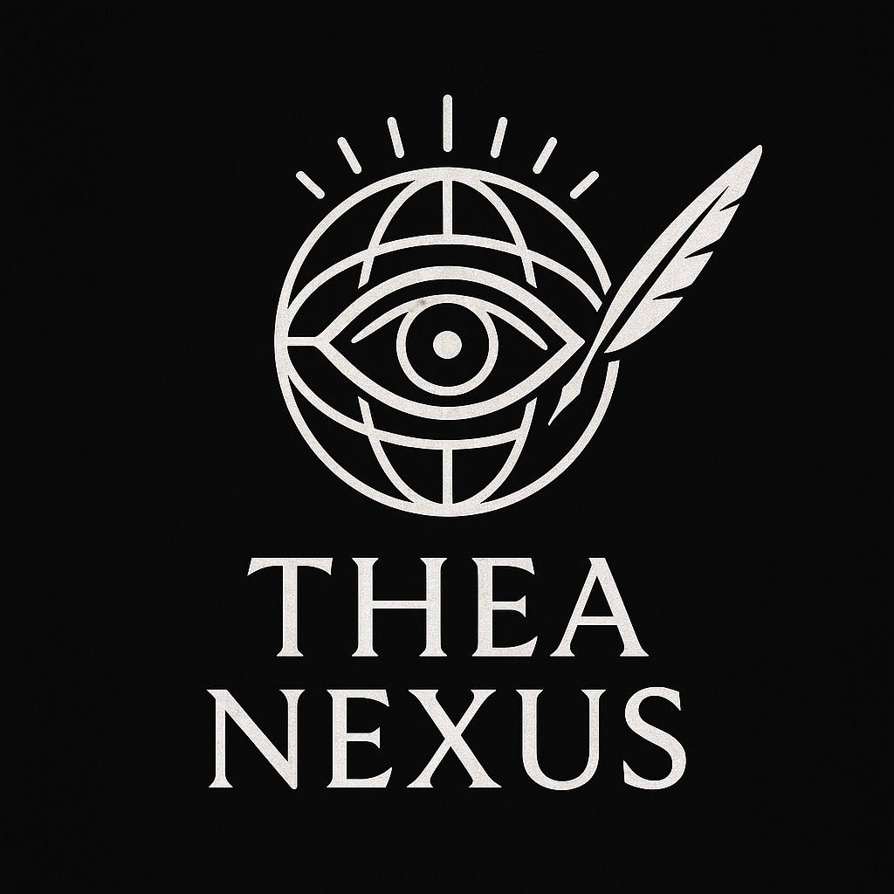

# TheaNexus 👁️🌍🖋️
TheaNexus: BRICS+ weekly brief
🇧🇷🇷🇺🇮🇳🇨🇳🇿🇦🇪🇬🇪🇹🇮🇷🇦🇪🇮🇩

## Index 📚
## The Tech 💻
TheaNexus scrapes a list of news outlets, identifies key actors and calculates the polarity of relevant headlines. The articles with the strongest positive or negative sentiment are assembled into a message for the Telegram bot.
### Scraping
It is done through a Python script. In a production environment it would run periodically using a cron job. It produces a list of entries saved as a CSV file.
### NER
Another Python script checks for the presence of relevant actors and loads the relevant entries to another CSV file.
### Polarity
A third Python script evaluates polarity (how strong the positive or negative sentiment is) and sends the 10 highest scores (positive or negative) to the message crafter.
### Message crafter
Builds a full and accessible message with the top headlines, source, link and country of origin. This reduces the saved data using rules instead of storing all information.
### Bot interaction
Publishes the final message to the bot through a Go module.
## Why BRICS+? 🚀
## Goals 🎯
- [ ] Select sources and build actor list
- [ ] Build scraper scripts
- [ ] NER check
- [ ] Polarity evaluation
- [ ] Message crafting
- [ ] Telegram interaction
- [ ] Local test